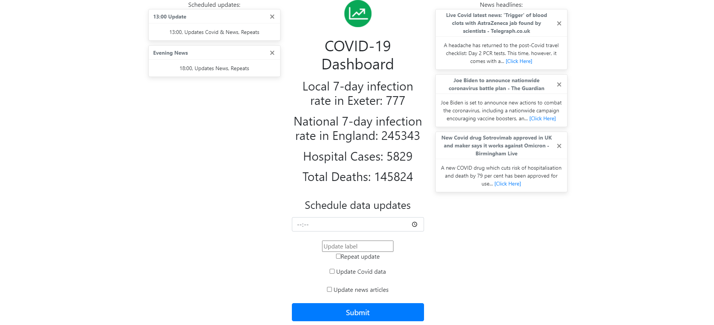

# ECM1400 Covid Dashboard - Charlie Goldstraw
This program is a dashboard containing current COVID data and news articles relating to COVID-19. The user can schedule updates to the COVID and news data, remove news articles, and cancel scheduled updates. The dashboard is designed to be run locally in flask.

This was made as the Continuous Assessment for the ECM1400 Programming module, and follows the tasks in the [specification](meta/CA-specification.pdf).

Screenshot:

## Documentation
The documentation is stored locally in the `docs` folder. Open `docs/index.html` to read the documentation.

The documentation can also be read statically [here](docs/static_docs.pdf).
## Dependencies
- Python 3.8+
- Flask 2.0.2+
- requests 2.26.0+
- uk_covid19 1.2.2+
## Installation
Copy the repository into a folder, navigate to the repository folder in command prompt and run:
- pip install -r requirements.txt
## Configuration
The `config.json` file may be modified to personalise the dashboard. Default values have been provided for every field except for news_API_key, which must be changed.
#### dashboard_title
The title displayed on the dashboard.
#### dashboard_favicon
The URL to the favicon of the dashboard.
#### covid_nation
The nation to display COVID data for.

From the list: "England", "Wales", "Scotland" and "Northern Ireland".
#### covid_local
A lower tier local authority to display COVID data for.

All lower tier local authorities listed in [all_local_locations.txt](meta/all_local_locations.txt).
#### covid_update_interval_seconds
An integer storing the number of seconds between repeating COVID updates.
#### news_API_key
Your API key from [newsapi.org](https://newsapi.org/). You can register for an API key [here](https://newsapi.org/register).
#### news_country_code
The 2-letter code of the country you want to get news headlines for.

From the list: ae, ar, at, au, be, bg, br, ca, ch, cn, co, cu, cz, de, eg, fr, gb, gr, hk, hu, id, ie, il, in, it, jp, kr, lt, lv, ma, mx, my, ng, nl, no, nz, ph, pl, pt, ro, rs, ru, sa, se, sg, si, sk, th, tr, tw, ua, us, ve, za.
#### news_update_interval_seconds
An integer storing the number of seconds between repeating news updates.
#### news_search_terms
A space-separated string containing terms to filter news headlines for.
## Usage
- Copy the repository to a folder.
- Generate a [newsapi.org](https://newsapi.org/) key from [here](https://newsapi.org/register).
- Fill the `news_API_key` field in `config.json` with your API key.
- Navigate to the repository folder in Command Prompt.
- Run `pip install -r requirements.txt` for first-time use.
- Run `python main.py`.
- Open a web browser and navigate to [127.0.0.1:5000/](http://127.0.0.1:5000/)
## Testing
The dashboard is tested with [pytest](https://docs.pytest.org/en/6.2.x/).
Once pytest is installed, the programs can be tested by running

`python -m pytest`

in the local repository directory in Command Prompt.
## Logging
The program will create a file named `sys.log` which will track events as they happen in the dashboard. This contains general information about the events, warnings if the program receives unexpected input and error messages if the program crashes.
## advanced
There is also a folder `advanced` included in the repository, containing a code golf version of specific sections of the specification. This is not intended to be marked in the ECM1400 coursework. More details are in [advanced/README.md](advanced/README.md).
## Open Source Licensing
This project is licensed with [Apache License, Version 2.0](https://www.apache.org/licenses/LICENSE-2.0).
- [LICENSE](LICENSE)
